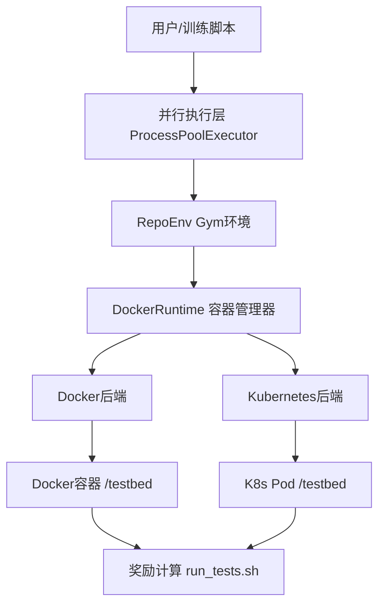
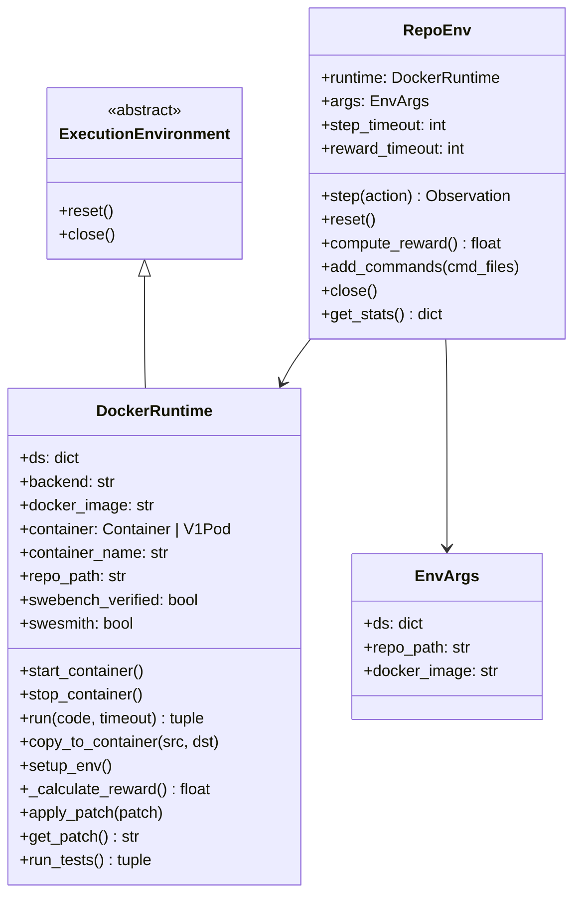
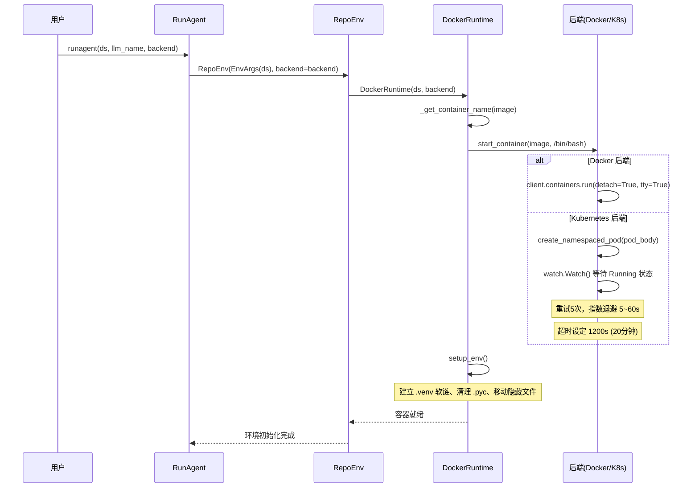
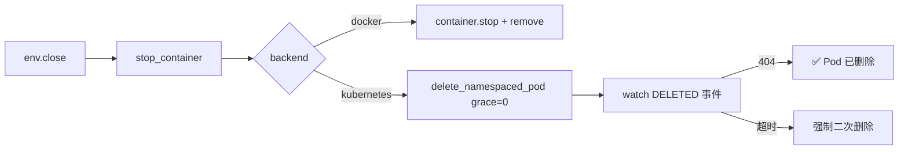
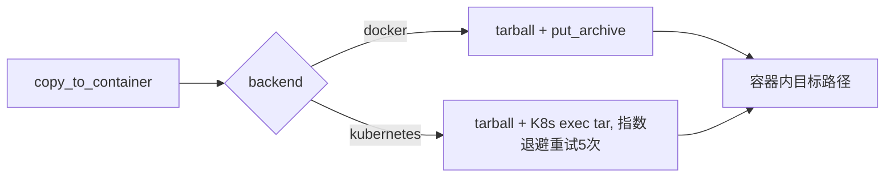
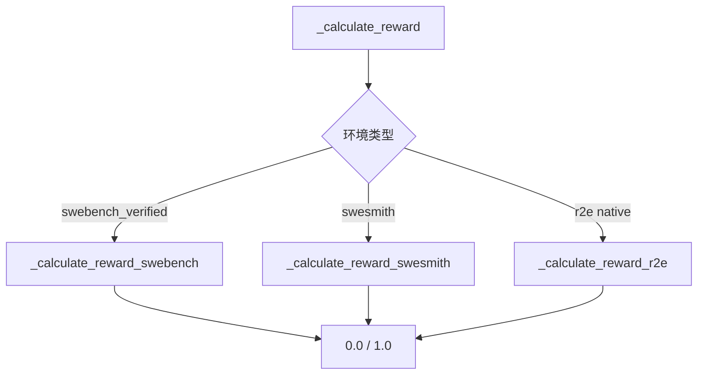
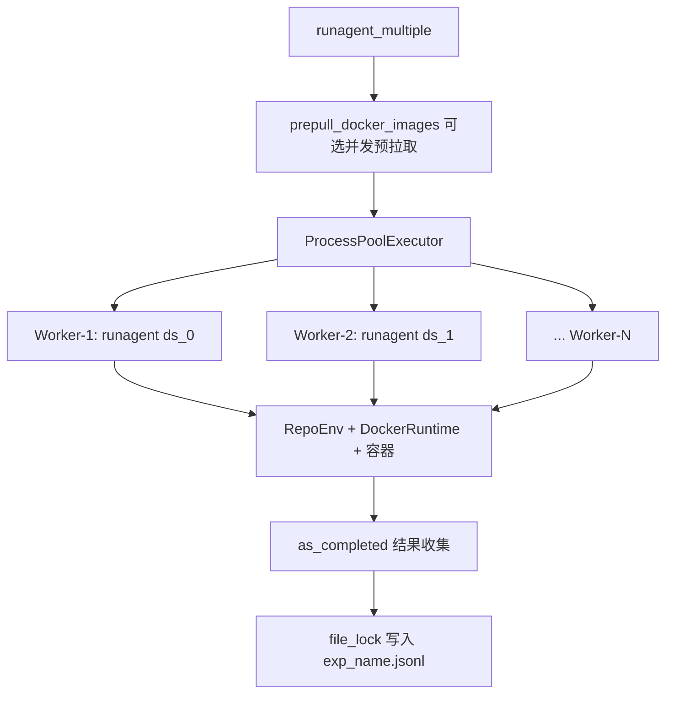

# R2E-Gym 容器环境管理架构报告

> 生成时间：2026-03-25 | 分析对象：[R2E-Gym](file:///home/robomaster/Research/R2E-Gym) Repository

---

## 1. 总体架构概述

R2E-Gym 是一个用于训练开源 SWE-Agent 的**程序化 Gym 环境框架**。其容器管理系统采用**分层抽象设计**，支持 **Docker** 和 **Kubernetes** 双后端，将每个代码仓库问题实例封装为隔离的容器化执行单元供 LLM Agent 交互和训练。



---

## 2. 核心组件层级



---

## 3. 关键文件清单

| 文件路径 | 职责 |
|---|---|
| [runtime/base.py](file:///home/robomaster/Research/R2E-Gym/src/r2egym/agenthub/runtime/base.py) | 抽象基类 `ExecutionEnvironment`，定义 `reset()`/`close()` 接口 |
| [runtime/docker.py](file:///home/robomaster/Research/R2E-Gym/src/r2egym/agenthub/runtime/docker.py) | 核心容器运行时（1146行），支持 Docker + K8s 双后端 |
| [environment/env.py](file:///home/robomaster/Research/R2E-Gym/src/r2egym/agenthub/environment/env.py) | `RepoEnv` Gym 封装，对 Agent 暴露 `step()`/`reset()` 接口 |
| [agenthub/run/edit.py](file:///home/robomaster/Research/R2E-Gym/src/r2egym/agenthub/run/edit.py) | 并行执行入口，`ProcessPoolExecutor` 管理多环境并发 |
| [docker_bash_utils/remove_containers.sh](file:///home/robomaster/Research/R2E-Gym/docker_bash_utils/remove_containers.sh) | 批量清理脚本，保留 vLLM/SGLang 推理服务容器 |
| [docker_bash_utils/docker_list_tags.py](file:///home/robomaster/Research/R2E-Gym/src/r2egym/docker_bash_utils/docker_list_tags.py) | Docker Hub Tag 枚举工具 |
| [install_utils/](file:///home/robomaster/Research/R2E-Gym/src/r2egym/install_utils/) | 各仓库专属安装脚本（pandas/numpy/bokeh 等 13 个仓库） |
| [agenthub/__init__.py](file:///home/robomaster/Research/R2E-Gym/src/r2egym/agenthub/__init__.py) | 全局常量：支持仓库列表、隐藏文件列表、命令超时 `CMD_TIMEOUT=120s` |

---

## 4. 容器生命周期管理

### 4.1 容器命名策略

```python
# 名称 = 镜像名（sanitize）+ SHA256(时间戳 + PID)[:10]
container_name = f"{image_name_sanitized}-{hash_object.hexdigest()[:10]}"
# Kubernetes backend: 使用随机 UUID（保证集群唯一性）
container_name = str(uuid.uuid4())
```

### 4.2 启动流程



### 4.3 环境初始化分支（`setup_env`）

系统根据 Docker 镜像名称自动判断数据集类型，执行不同的初始化逻辑：

| 数据集类型 | 识别标志 | 初始化行为 |
|---|---|---|
| **R2E 原生** | 默认 | 建立 `.venv` 软链、清理 `__pycache__`、隐藏测试文件到 `/root/` |
| **SWEBench-Verified** | image 含 `"swebench"` | `chmod +x /run_tests.sh`、conda→`.venv` 软链 |
| **SWESmith** | image 含 `"swesmith"` | `git checkout base_commit`、生成 `/run_tests.sh`、激活 conda testbed |

### 4.4 停止/清理流程



---

## 5. 命令执行机制

### 5.1 Docker 后端执行

```python
# 核心调用链
container.exec_run(
    cmd=["/bin/sh", "-c", f"timeout {timeout} {code}"],
    workdir=repo_path,
    environment={"PATH": DOCKER_PATH},
    stdout=True, stderr=True
)
# 外层安全套 timeout+5s via ThreadPoolExecutor
future.result(timeout=timeout + 5)
```

### 5.2 Kubernetes 后端执行

```python
# 通过 K8s streaming exec API
stream(
    client.connect_get_namespaced_pod_exec,
    container_name, namespace,
    command=["/bin/sh", "-c", f"timeout {timeout} {code}"],
    _preload_content=False  # 流式读取 stdout/stderr
)
# 同样有 timeout+5s 线程级超时保护
```

### 5.3 超时层级

```
CMD_TIMEOUT = 120s          ← 常规命令（__init__.py 常量）
step_timeout = 90s          ← Agent 单步操作
reward_timeout = 300s       ← 奖励计算（运行测试套件）
start_container timeout = 1200s  ← K8s Pod 启动等待
```

---

## 6. 文件传输机制



文件拷贝触发场景：
- `apply_patch()` — 将 git patch 写入容器并 `git apply`
- `add_commands()` — 将 Agent 工具脚本注入 `/usr/local/bin/`
- `setup_env_swesmith()` — 生成并注入 `/run_tests.sh`

---

## 7. 奖励计算流程



**奖励规则**（均为二元 0/1）：
- **R2E**：测试解析结果与 `expected_output_json` 完全匹配 → 1.0
- **SWEBench**：`get_resolution_status()` == `FULL` → 1
- **SWESmith**：所有 `FAIL_TO_PASS` 测试通过 AND 所有 `PASS_TO_PASS` 未回退 → 1.0

---

## 8. 并行执行架构



> [!IMPORTANT]
> 并行执行层使用 **ProcessPoolExecutor**（多进程）而非线程池，避免 Python GIL 限制，确保每个 Agent 进程独立管理自己的 Docker/K8s 连接。文件写入通过 `threading.Lock` 互斥保护，防止 JSONL 输出损坏。

---

## 9. 镜像与容器生态

### 9.1 镜像类型

| 镜像前缀 | 数量 | 大小 | 来源 |
|---|---|---|---|
| `namanjain12/{repo}new:{commit_hash}` | ~8100 个 | 300-500 MB / 个 | R2E-Gym 自建 |
| `swebench/*` | ~500 个 | - | SWE-Bench Verified |
| `jyangballin/swesmith_*` | 若干 | - | SWESmith |
| `vllm/vllm-openai:latest` | 1 | - | 推理服务（受保护） |
| `lmsysorg/sglang:latest` | 1 | - | 推理服务（受保护） |

### 9.2 容器内目录结构

```
/testbed/          ← 主仓库路径 (repo_path)
  ├── .venv/       ← Python 虚拟环境
  └── r2e_tests -> /root/r2e_tests  (软链)
/root/             ← alt_path (隐藏区)
  ├── .venv -> /testbed/.venv
  ├── .local/bin/  ← Python 可执行文件软链
  └── r2e_tests/   ← 测试文件（对 Agent 隐藏）
/run_tests.sh      ← 测试执行入口脚本
/usr/local/bin/    ← Agent 工具命令注入路径
```

---

## 10. 运维脚本体系

| 脚本 | 功能 |
|---|---|
| [remove_containers.sh](file:///home/robomaster/Research/R2E-Gym/docker_bash_utils/remove_containers.sh) | 停止并删除所有 Gym 容器，**智能跳过** vLLM/SGLang 推理服务 |
| [stop_containers.sh](file:///home/robomaster/Research/R2E-Gym/docker_bash_utils/stop_containers.sh) | 仅停止（不删除）全部容器 |
| [remove_images.sh](file:///home/robomaster/Research/R2E-Gym/docker_bash_utils/remove_images.sh) | 删除指定镜像 |
| [docker_list_tags.py](file:///home/robomaster/Research/R2E-Gym/src/r2egym/docker_bash_utils/docker_list_tags.py) | 查询 Docker Hub 镜像 Tags（分页枚举） |
| [docker_list_tags_remove_local.py](file:///home/robomaster/Research/R2E-Gym/src/r2egym/docker_bash_utils/docker_list_tags_remove_local.py) | 对比 Hub Tags 与本地镜像，删除本地多余镜像 |

---

## 11. 架构设计模式总结

| 设计模式 | 应用位置 | 说明 |
|---|---|---|
| **策略模式 (Strategy)** | `DockerRuntime.backend` | Docker/K8s 两套实现，接口统一，运行时切换 |
| **模板方法 (Template Method)** | `setup_env()` / `_calculate_reward()` | 总入口分派给 3 种子方法 |
| **门面模式 (Facade)** | `RepoEnv` | 对 Agent 隐藏容器复杂性，暴露简洁 Gym 接口 |
| **工厂方法** | `_get_container_name()` | 基于时间戳+PID 生成唯一容器名 |
| **批量预取** | `prepull_docker_images()` | 并行预拉取镜像，减少主执行等待 |
| **指数退避重试** | K8s Pod 创建 + 文件拷贝 | 最多 5 次，延迟 5→10→20→40→60s |
| **双层超时** | `run()` 方法 | 内层 `timeout` 命令 + 外层 `ThreadPoolExecutor.result(timeout+5)` |
