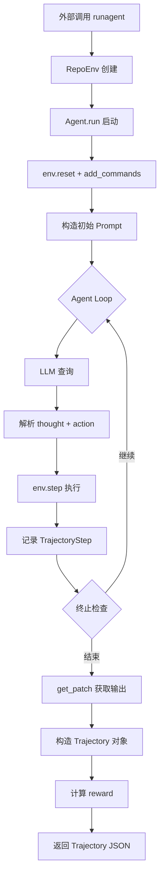

# R2E-Gym Rollout 完整调用链路

> 从外部创建 env 到 rollout 结束的完整数据流与参数链路

---

## 总览



---

## 第一阶段：环境创建

### 入口：`runagent(ds, ...)`
**文件**：`src/r2egym/agenthub/run/edit.py`

```
输入参数：
  ds             : dict        — HuggingFace 数据集单条记录（核心数据源）
  llm_name       : str         — 模型名 (gpt-4o / claude-3-5-sonnet / vllm/...)
  backend        : str         — "docker" 或 "kubernetes"
  max_steps      : int = 40    — Agent 软步数上限
  temperature    : float = 0   — LLM 温度
  use_fn_calling : bool = True — 是否使用 Function Calling
  scaffold       : str         — "r2egym" / "sweagent" / "openhands"
  max_tokens     : int = 65536 — 上下文 token 上限
  ...（其他限制参数）
```

### `ds` 数据集记录关键字段

| 字段 | 用途 |
|---|---|
| `docker_image` / `image_name` | 确定要启动的容器镜像 |
| `repo` / `repo_name` | 仓库名称 |
| `problem_statement` | 任务描述（填入 prompt） |
| `parsed_commit` / `parsed_commit_content` | GT commit 解析结果（用于构造 prompt hint） |
| `base_commit` | SWESmith 用于 git checkout |
| `FAIL_TO_PASS` / `PASS_TO_PASS` | 奖励计算用测试集 |
| `expected_output_json` | R2E 奖励对比基准 |

---

### `RepoEnv.__init__`
**文件**：`src/r2egym/agenthub/environment/env.py`

```
输入：
  args         : EnvArgs(ds, repo_path=None, docker_image=None)
  backend      : str = "docker"
  step_timeout : int = 90s    — 单步超时
  reward_timeout: int = 300s  — 奖励计算超时

内部调用：
  DockerRuntime(ds, backend)   ← 启动容器
```

### `DockerRuntime.__init__`
**文件**：`src/r2egym/agenthub/runtime/docker.py`

```
关键操作：
  1. 从 ds 读取 docker_image（优先 ds["docker_image"] 或 ds["image_name"]）
  2. 识别环境类型：
       swebench_verified = "swebench" in image_name
       swesmith          = "swesmith" in image_name
       r2e_native        = 默认
  3. _get_container_name(image) → "{image}-{sha256[:10]}"
  4. start_container(image, /bin/bash)
       Docker:     client.containers.run(detach=True, tty=True)
       Kubernetes: create_namespaced_pod + watch.Watch 等待 Running（超时 1200s）
  5. setup_env()
       r2e_native:  .venv 软链、清理 .pyc、隐藏 run_tests.sh 到 /root/
       swebench:    chmod +x /run_tests.sh、conda→.venv 软链
       swesmith:    git checkout base_commit、生成 /run_tests.sh
```

---

## 第二阶段：Agent 初始化与 Prompt 构造

### `Agent.run(env, ...)`
**文件**：`src/r2egym/agenthub/agent/agent.py:304`

```
输入参数：
  env                : RepoEnv
  use_fn_calling     : bool = True
  max_steps          : int = 10      — 软步数上限（超出后提示 submit）
  max_steps_absolute : int = 50      — 硬步数上限（强制终止）
  max_token_limit    : int = 65536   — 上下文 token 硬上限
  max_exec_time      : int = 90s     — 单步 env 执行超时
  max_total_time     : int = 50000s  — 整轮 rollout 总时间上限
  max_llm_time       : int = 7200s   — 单次 LLM 查询超时
  temperature        : float = 0
  metadata           : dict = {}     — 额外 hint 注入
  scaffold           : str = "r2egym"
```

**`metadata` 可注入的字段**：
| 字段 | 用途 |
|---|---|
| `test_patch_hint` | 测试 patch 提示（填入 user_prompt） |
| `candidate_patch` | 候选 patch（用于 verifier 场景） |
| `candidate_patch_correctness` | 候选 patch 是否正确 |

### Prompt 构造
```
env.reset()                           → 重启容器（重新 setup_env）
env.add_commands(command_files)       → 注入工具脚本到 /usr/local/bin/

problem_statement = env.runtime.get_task_instruction()
gt_patch          = env.runtime.commit.get_patch(test_file=True)   # 测试 patch hint

system_prompt = AgentArgs.system_prompt (from YAML)
user_prompt   = AgentArgs.instance_prompt.format(
    problem_statement     = problem_statement,
    gt_patch              = gt_patch,
    working_dir           = '/testbed',
    test_patch_hint       = metadata.get("test_patch_hint", ""),
    candidate_patch       = metadata.get("candidate_patch", ""),
    candidate_patch_correctness = "correct"/"incorrect",
)

可选：若 use_demo=True，前置 demo 文件内容到 user_prompt

history = [
    {"role": "system", "content": system_prompt},
    {"role": "user",   "content": user_prompt + "\nSteps Remaining: N"},
]
```

---

## 第三阶段：Agent Loop（Rollout 主循环）

每一步循环：

```
┌─────────────────────────────────────────────────────┐
│ 1. 查询 LLM                                          │
│    litellm.completion(                               │
│        model      = llm_name,                        │
│        messages   = history (含 system+user+历史),   │
│        tools      = [search, file_editor, bash, ...] │  ← fn_calling 模式
│        temperature= temperature,                     │
│        timeout    = max_llm_time,                    │
│    )                                                 │
│    → response (choices[0].message)                   │
│                                                      │
│ 2. 解析响应                                           │
│    fn_calling 模式: custom_parser → (thought, Action)│
│    非 fn_calling:   parse_response → (thought, Action│
│                     正则匹配 <function=...>)          │
│                                                      │
│ 3. 执行动作                                           │
│    obs, reward, done, info = env.step(action)        │
│      → env.run_action → runtime.run(bash_cmd, 90s)  │
│      → docker exec_run / K8s stream exec             │
│      → 返回 (output_str, exit_code)                  │
│                                                      │
│ 4. 更新 history                                      │
│    fn_calling: assistant_msg + tool_response         │
│    非 fn_calling: assistant + user(obs)              │
│                                                      │
│ 5. 记录 TrajectoryStep                               │
│    step_idx, thought, action, observation, done      │
│    token_usage_prompt/completion/total               │
│    llm_exec_time, env_exec_time, total_step_time     │
└─────────────────────────────────────────────────────┘
```

### 终止条件

| 条件 | exit_reason |
|---|---|
| Agent 调用 finish/submit 工具（`done=True`，步数未到上限） | `agent` |
| Agent 调用 finish/submit（步数恰好达到上限） | `max_step_limit` |
| Agent 在超过上限后 finish | `agent_max_step_limit` |
| `step_count >= max_steps_absolute` | `abs_step_limit` |
| `total_tokens >= max_token_limit` | `token_limit` |
| `total_time >= max_total_time` | `traj_time_limit` |
| LLM 查询异常 | `llm_query_error` |

---

## 第四阶段：输出构造

### 输出 Patch
```python
output_patch = env.runtime.get_patch()
# → git add -A && git diff --cached
# → 返回完整 unified diff 字符串
```

### 奖励计算（在 `runagent` 中，env.close() 前）
```python
reward, test_output = env.runtime._calculate_reward(get_test_output=True, timeout=300s)
```

| 环境类型 | 计算方式 |
|---|---|
| R2E 原生 | 运行 `/root/run_tests.sh`，解析输出对比 `expected_output_json` |
| SWEBench | 运行 `/run_tests.sh`，用 swebench grader 判 FULL resolved |
| SWESmith | reset 测试文件到 base_commit，运行测试，检查 F2P/P2P |

### 最终输出：`Trajectory` 对象

```python
Trajectory(
    # 轨迹数据
    trajectory_steps  = [TrajectoryStep, ...],   # 每步 thought/action/obs/token/time

    # 问题元数据
    problem_statement = str,
    docker_image      = str,
    ds                = dict,                    # 原始数据集记录

    # 配置参数（原样保存）
    agent_args        = dict,
    env_args          = dict,
    max_steps, max_steps_absolute, max_token_limit,
    max_llm_time, max_exec_time, max_total_time,

    # 核心输出
    exit_reason       = str,                     # 终止原因
    output_patch      = str,                     # agent 生成的 git diff patch
    reward            = float,                   # 0.0 / 1.0
    test_output       = str,                     # 测试执行原始输出

    # 可选评估字段
    reward_calc_time  = float,
    verifier_prob     = float,                   # 执行无关 verifier 打分
    regression_test_output = str,               # 回归测试输出
    reproduction_test_scores = list[int],       # 复现测试分数
)
```

最终以 `.model_dump_json()` 序列化追加写入 `{traj_dir}/{exp_name}.jsonl`。

---

## 完整调用栈速查

```
runagent_multiple(dataset, k, max_workers)
  └── ProcessPoolExecutor → runagent(ds, ...)
        ├── RepoEnv(EnvArgs(ds), backend)
        │     └── DockerRuntime(ds, backend)
        │           ├── start_container(image, /bin/bash)
        │           └── setup_env()
        ├── Agent(name, AgentArgs)
        └── Agent.run(env, max_steps, metadata, ...)
              ├── env.reset()            ← 重建容器
              ├── env.add_commands()     ← 注入工具
              ├── [构造 system + user prompt]
              └── while not done:
                    ├── litellm.completion(history, tools)
                    ├── parse → (thought, Action)
                    ├── env.step(action)
                    │     └── runtime.run(bash_cmd, 90s)
                    │           └── docker exec_run / K8s stream
                    ├── history.append(assistant + obs)
                    └── TrajectoryStep 记录
              ├── get_patch()            ← git diff 输出
              └── Trajectory(...)        ← 汇总所有数据
        └── _calculate_reward()         ← 运行测试套件
              └── 返回 (reward, test_output)
```
